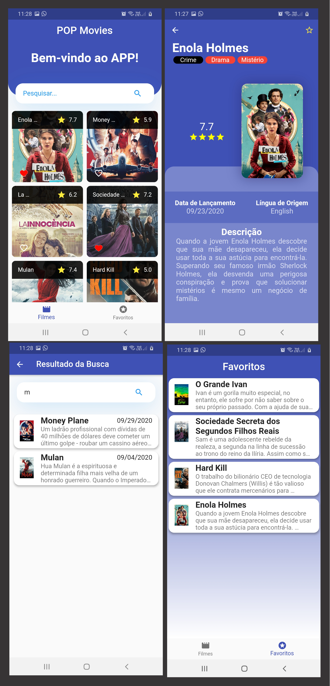

# Movies APP

Projeto feito tendo como base de dados a API The Movie Database.

## Recursos

- Tela inicial mostrando todos os filmes populares com a opção de pesquisa, favoritar filmes e carregar mais filmes populares

- Tela de pesquisa

- Tela de favoritos que além de mostrar os favoritos, também permite arrastar cada Card para a esquerda e excluir o favorito ou arrastando para a direita e navegar para a página da internet referente ao filme escolhido

- Tela que mostra cada filme detalhado, também contendo a opção de favoritar/desfavoritar nas actions

- Na tela inicial ao tocar e segurar em cada GridTile aparece a opção de compartilhar o filme com os contatos

- SplashScreen com animação feita no Flare e fundo feito no Corel Draw

- Animação do coração ao favoritar/desfavoritar

- Possibilidade de recarregar a lista de filmes populares apenas "puxando" GridView para baixo (uso do RefreshIndicator)

Vídeo no Youtube mostrando o APP rodando:

- [Movies App](https://youtu.be/FYp8zFuaTNI)
